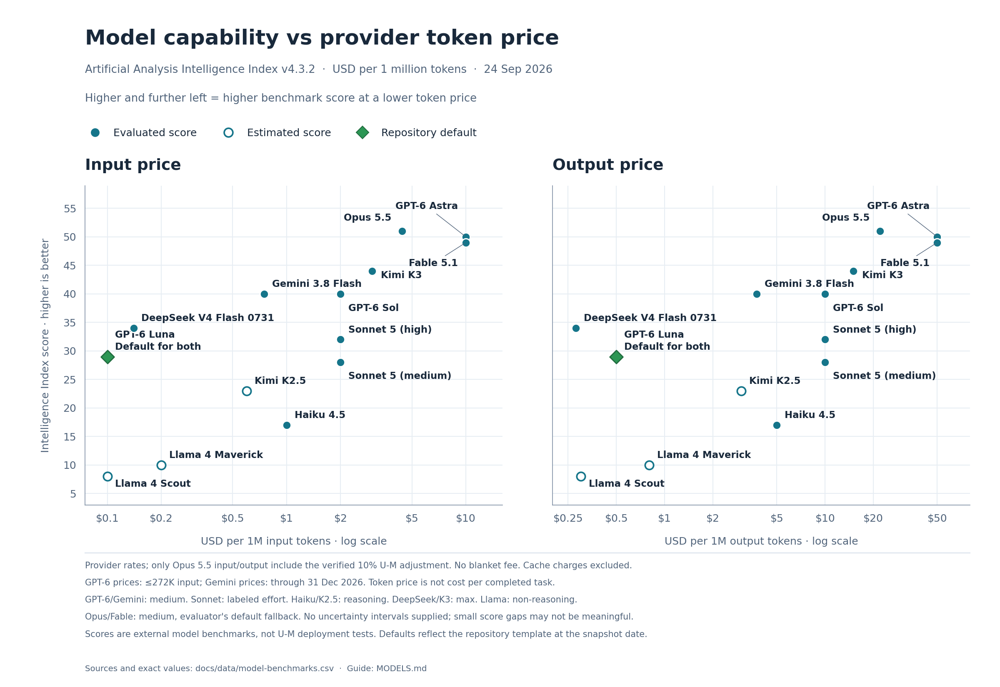

# Model settings and comparison

[Change defaults and order](#change-defaults-and-order) · [Compare models](#compare-models) · [All models and source details](docs/model-reference.md)

Compare models below before [setting up U-M GPT](docs/umgpt.md). Once your
`umgpt` or `umgpt-low` identity exists, use the steps here to change its saved
default and picker order.

## Change defaults and order

Run these commands from the repository directory, after creating the identity
you want to update. The helper skips either standard identity that does not exist.

**1. Find your settings file.**

```bash
./bin/codex-home model-settings
```

Open the path printed after **Edit your settings:**, normally
`~/.codex-homes/umgpt-models.toml`. Your choices survive repository updates.

**2. Choose your defaults and favorites.**

```toml
umgpt = "gpt-6-luna"
umgpt_low = "gpt-6-luna"

umgpt_order = ["gpt-6-sol", "gpt-6-astra", "o3"]
umgpt_low_order = ["claude-sonnet-5", "gemini-3.8-flash", "claude-haiku-4-5"]
```

The first two lines select defaults; the arrays put your other favorites in
order. Keep each array on one line. Use `[]` for automatic ordering.
Find exact IDs in the [available model list](docs/model-reference.md#available-models).

The picker shows **your default → your favorites → remaining models by family,
newer versions first**. Sorting never changes your default. The example above
starts the low picker with Luna → Sonnet → Gemini → Haiku.

**3. Apply, reload, and check.**

```bash
./bin/codex-home apply-model-settings
```

Restart the CLI, or run **Developer: Reload Window** in VS Code and start a
**new Codex chat**. Check your choices in the model picker. Run
`model-settings` again to compare saved and active defaults.

[Changes not showing?](docs/model-reference.md#refresh-and-recovery) · [Reset or use a model for one session](docs/model-reference.md#other-model-settings)

## Compare models

**24 September 2026 · USD per million tokens.** Scores use Artificial Analysis
**Intelligence Index v4.3.2**; higher is better. Prices use provider rates,
with only Opus 5.5's verified 10% U-M adjustment. [Sources and pricing conditions](docs/model-reference.md#prices-and-limits).

| Model | Index | Input | Output | Context¹ | Tokens/s² |
|---|---:|---:|---:|---:|---:|
| [GPT-6 Luna](https://artificialanalysis.ai/models/gpt-6-luna-medium) | 29 | $0.10 | $0.50 | 1.05M | 142.8 |
| [GPT-6 Sol](https://artificialanalysis.ai/models/gpt-6-sol-medium) | 40 | $2.00 | $10.00 | 1.05M | 114.3 |
| [GPT-6 Astra](https://artificialanalysis.ai/models/gpt-6-astra-medium) | 50 | $10.00 | $50.00 | 1.05M | 45.3 |
| [Claude Haiku 4.5](https://artificialanalysis.ai/models/claude-4-5-haiku-reasoning) | 17 | $1.00 | $5.00 | 200K | 96.1 |
| [Claude Sonnet 5](https://artificialanalysis.ai/models/claude-sonnet-5-medium) | 28 | $2.00 | $10.00 | 1M | 67.1 |
| [Claude Opus 5.5](https://artificialanalysis.ai/models/claude-opus-5-5-medium) | 51 | $4.40 | $22.00 | 1M | 77.9 |
| [Claude Fable 5.1](https://artificialanalysis.ai/models/claude-fable-5-1-medium/) | 49 | $10.00 | $50.00 | 1M | 54.1 |
| [Gemini 3.8 Flash](https://artificialanalysis.ai/models/gemini-3-8-flash-medium) | 40 | $0.75 | $3.75 | 1M input | — |
| [DeepSeek V4 Flash 0731](https://artificialanalysis.ai/models/deepseek-v4-flash) | 34 | $0.14 | $0.28 | 1M | 221.1 |
| [Kimi K3](https://artificialanalysis.ai/models/kimi-k3) | 44 | $3.00 | $15.00 | 1M | 35.3 |
| [Kimi K2.5](https://artificialanalysis.ai/models/kimi-k2-5) | 23* | $0.60 | $3.00 | 256K | — |
| [Llama 4 Maverick](https://artificialanalysis.ai/models/llama-4-maverick) | 10* | $0.20 | $0.80 | 1M | 114.9 |
| [Llama 4 Scout](https://artificialanalysis.ai/models/llama-4-scout/) | 8* | $0.10 | $0.30 | 328K | 100.1 |

\* Estimated by the evaluator; independent evaluation on this index is pending.
¹ Rounded provider limits, not verified U-M limits. ² Output speed after the
initial wait, not measured through U-M. “—” means not reported.
[Test settings, cached-input prices, exact limits, and qualifications](docs/model-reference.md).

In this shortlist, Sonnet 5 at medium effort is the closest Claude option to
Luna on this index. Haiku is the cheaper Claude alternative. Luna is the
repository default for both identities.



Higher and further left means a higher score at a lower token price; token
price does not measure cost per completed task. The chart also shows Sonnet
at high effort (index 32; 65.4 tokens/s). Small score gaps may not be meaningful.

[Full-size chart](docs/images/model-cost-performance-direct.png) · [SVG](docs/images/model-cost-performance-direct.svg) · [Data and sources (CSV)](docs/data/model-benchmarks.csv)

[Back to README](README.md) · [U-M GPT setup](docs/umgpt.md)
