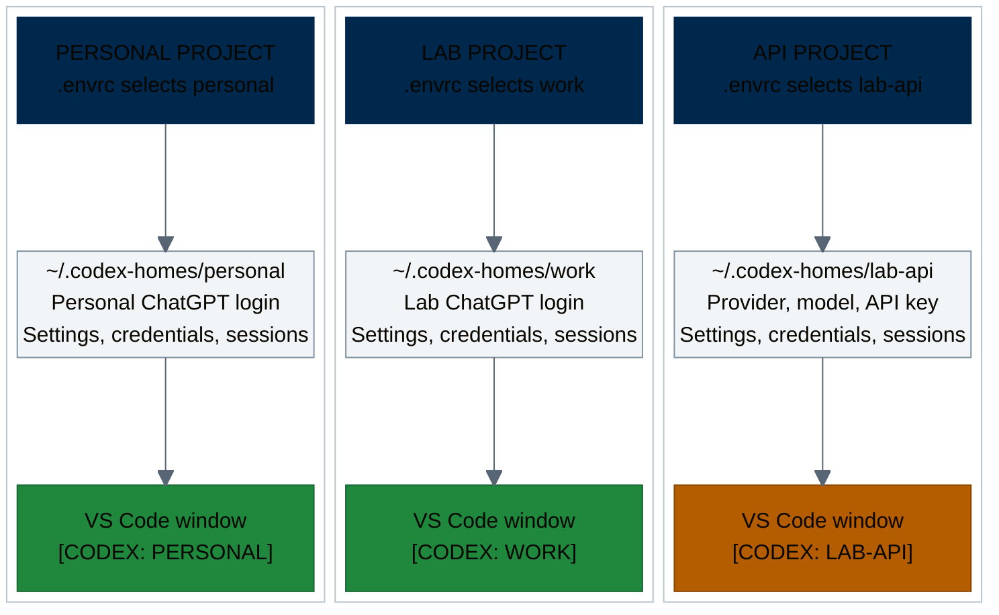

# Codex Contexts

Codex Contexts helps you keep personal, lab, and other Codex accounts apart.
Choose an account or API provider for each project, then open a clearly labeled
VS Code window or run Codex from the terminal.

The `codex-home` command gives each account or provider its own local
`CODEX_HOME` directory, called an **identity**. It runs on macOS
and Linux, with optional `direnv`, VS Code, and macOS Finder integration.

Developed at the [Fritsche Lab](https://fritschelab.org/), University of Michigan.

## One account choice per project

Each project's `.envrc` selects an identity and its `CODEX_HOME`. The account,
API key, and provider settings stay in that home, outside the project.



Several projects can use the same identity; they then share its login, settings,
and session history. Each VS Code window shows the identity name, with a
separate VS Code user-data directory per identity. In a configured project's
terminal, start the selected context with `codex-home run`.

On macOS, the helper opens a named editor copy: hover over its running Dock
icon to read `VS Code - NAME`. Projects using the same identity reuse its
instance. After quitting, start it through `codex-home` or Finder's **Quick
Actions > Open in Codex Project**; do not pin or directly open the generated
editor copy, which needs the helper's launch environment. See
[macOS Dock names](docs/projects-vscode.md#macos-dock-names).

The CLI launcher keeps **[CODEX: NAME]** in the terminal tab/window title.

Use research data only with a provider, model, and workflow approved for it.
Separate homes help avoid account mix-ups; they do not provide a security
sandbox. Keep credentials and identity homes private. See the
[security guide](docs/security.md) for storage and data-handling details.

## Get started

[Install the prerequisites and clone the repository](INSTALLATION.md).
The helper runs without administrator rights; installing some prerequisites
may require them.

From the clone directory, create a ChatGPT identity and sign in:

```bash
./bin/codex-home create-subscription personal
./bin/codex-home login personal
./bin/codex-home run personal
```

For an API key, follow the [API provider](docs/api-providers.md) or
[U-M GPT](docs/umgpt.md) guide. Each guide covers access, billing, and a test of
Codex tool calls with your selected model.

U-M GPT model recommendations are kept in the visible, version-controlled
file [`config/umgpt-models.toml`](config/umgpt-models.toml). Users can keep
different local defaults in `~/.codex-homes/umgpt-models.toml`; run
`codex-home umgpt-defaults` to compare them. Neither file is a model catalog:
`codex-home models umgpt` and `codex-home models umgpt-low` query the gateway's
current scoped model lists. The dated
[model snapshot](docs/umgpt-models-snapshot.md) records one credential's
observed catalog for review only; it is not used at runtime or an approval
list.

To use your identity for a project in VS Code:

```bash
./bin/codex-home project personal "/path/to/project"
direnv allow "/path/to/project"
./bin/codex-home vscode personal "/path/to/project"
```

Review `.envrc` before running `direnv allow`: it contains executable shell
code and local paths. The helper preserves existing project files and uses
local Git exclusions for the files it generates. Start a new Codex chat and
check `/status` to confirm the account and provider.

For right-click access on macOS, run `./bin/install-macos-open-with`, then
choose **Quick Actions > Open in Codex Project** on a project folder. The
[Finder guide](docs/macos-open-with.md) covers installation and menu discovery.

## Guides

[Download the two-page cheatsheet (PDF)](docs/codex-contexts-cheatsheet.pdf)
for setup steps and everyday commands.

| Task | Guide |
|---|---|
| Install, update, or set up another computer | [Installation](INSTALLATION.md) |
| Keep ChatGPT accounts and workspaces separate | [Subscriptions](docs/subscriptions.md) |
| Use an API key or Azure endpoint | [API providers](docs/api-providers.md) |
| Connect to the U-M GPT Toolkit | [U-M GPT setup and costs](docs/umgpt.md) |
| Select an account by project | [Projects and VS Code](docs/projects-vscode.md) |
| Open a project from Finder | [macOS integration](docs/macos-open-with.md) |
| Reuse personal skills across accounts | [Sharing skills](docs/skills.md) |
| Look up a command or fix a problem | [Commands](docs/commands.md) · [Troubleshooting](docs/troubleshooting.md) |
| Check credential storage and data restrictions | [Security guide](docs/security.md) |

Contributions and corrections are welcome. See [Contributing](CONTRIBUTING.md)
for tests and development setup, and [Security policy](SECURITY.md) to report
a vulnerability privately.

## Acknowledgments

Thanks to Ryan Welch for sharing his `direnv` setup and highlighting the need
for clearly labeled sessions to avoid mixing up accounts. Both inspired Codex
Contexts.

Released under the [MIT License](LICENSE).
