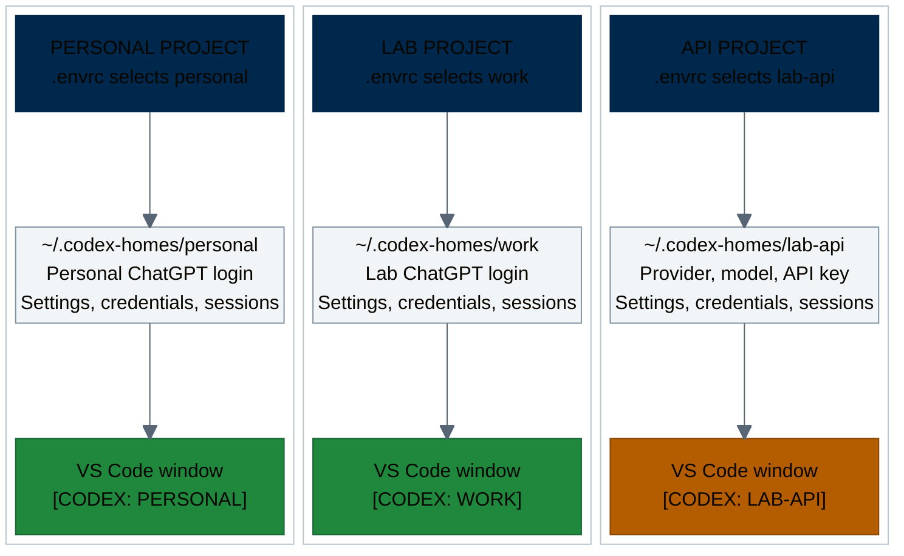

# Codex Contexts

Codex Contexts helps you keep personal, lab, and other Codex accounts apart.
Choose an account or API provider for each project, then open a clearly labeled
VS Code window or run Codex from the terminal.

An **identity** is a named Codex configuration for an account or API provider.
Its **home** is the private directory selected by `CODEX_HOME`. A **project
context** selects which identity a project uses.

The `codex-home` command manages these identities on macOS and Linux, with
optional `direnv`, VS Code, and macOS Finder integration.

Developed at the [Fritsche Lab](https://fritschelab.org/), University of Michigan.

| Start here | Next step |
|---|---|
| First setup on this computer | [Install prerequisites, create an identity, and configure a project](INSTALLATION.md) |
| Already have an identity | [Assign it to a project and launch Codex](docs/projects-vscode.md) |
| Choosing or changing U-M models | [Compare models and set defaults](MODELS.md) |
| Something went wrong | [Find the symptom in Troubleshooting](docs/troubleshooting.md) |

## One account choice per project

Each project's `.envrc` selects an identity and its `CODEX_HOME`. The account,
API key, and provider settings stay in that home, outside the project.



Several projects can use the same identity; they then share its login, settings,
and session history. Each VS Code window shows the identity name, with a
separate VS Code user-data directory per identity. In a configured project's
terminal, start the selected context with `codex-home run`.

On macOS, the helper also gives each identity a [named Dock icon](docs/projects-vscode.md#macos-dock-names)
and offers optional [Finder integration](docs/macos-open-with.md).

The CLI launcher keeps **[CODEX: NAME]** in the terminal tab/window title.

Use research data only with a provider, model, and workflow approved for it.
Separate homes help avoid account mix-ups; they do not provide a security
sandbox. Keep credentials and identity homes private. See the
[security guide](docs/security.md) for storage and data-handling details.

## Get started

If the prerequisites are installed and the clone is ready, use this quick path.
Otherwise, begin with [Installation](INSTALLATION.md).

From the clone directory, create a ChatGPT identity and sign in:

```bash
./bin/codex-home create-subscription personal
./bin/codex-home login personal
```

Check the intended account and workspace in the browser during sign-in, then
follow [Check the selected identity](docs/commands.md#check-the-selected-identity)
to verify the login and launch a CLI session.

For an API key, start with [API providers](docs/api-providers.md) or
[U-M GPT](docs/umgpt.md). Those guides cover access, billing, and a tool-call
test with your selected model.

Next, [assign the identity to a project](docs/projects-vscode.md#generate-project-files).
That guide covers generating and reviewing the files, approving `.envrc`, and
launching from the terminal or VS Code. Review `.envrc` before approving it:
it contains executable shell code and local paths.

For right-click access on macOS, follow the optional
[Finder setup](docs/macos-open-with.md#install-the-finder-integration).

## Guides

[Download the two-page cheatsheet (PDF)](docs/codex-contexts-cheatsheet.pdf)
for setup steps and everyday commands.

| Task | Guide |
|---|---|
| Install, update, or set up another computer | [Installation](INSTALLATION.md) |
| Keep ChatGPT accounts and workspaces separate | [Subscriptions](docs/subscriptions.md) |
| Use an API key or Azure endpoint | [API providers](docs/api-providers.md) |
| Connect to the U-M GPT Toolkit | [U-M GPT setup and costs](docs/umgpt.md) |
| Choose models, compare costs, or change picker order | [Model settings and comparison](MODELS.md) |
| Select an account by project | [Projects and VS Code](docs/projects-vscode.md) |
| Remove Codex settings from a folder, including when the menu fails | [Folder removal guide](docs/remove-folder-context.md) |
| Open a project from Finder | [macOS integration](docs/macos-open-with.md) |
| Remove extra VS Code entries from Open With | [Remove one or all entries](docs/macos-open-with.md#remove-extra-vs-code-entries-from-open-with-on-macos) |
| Reuse personal skills across accounts | [Sharing skills](docs/skills.md) |
| Look up a command or fix a problem | [Commands](docs/commands.md) · [Troubleshooting](docs/troubleshooting.md) |
| Check credential storage and data restrictions | [Security guide](docs/security.md) |

Contributions and corrections are welcome. See [Contributing](CONTRIBUTING.md)
for tests and development setup, and [Security policy](SECURITY.md) to report
a vulnerability privately.

## Acknowledgments

Thanks to Ryan Welch for sharing his `direnv` setup and highlighting the need
for clearly labeled sessions to avoid mixing up accounts. Both inspired Codex
Contexts.

Released under the [MIT License](LICENSE).
