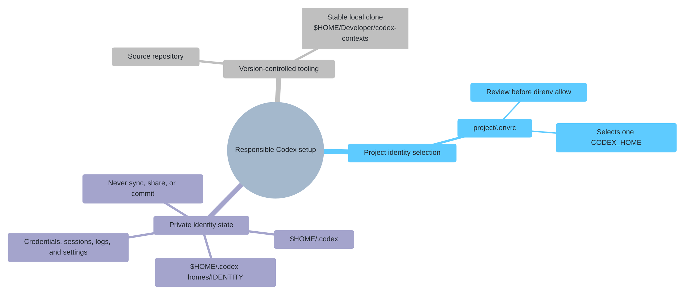

# Security model

Codex Contexts helps you choose the right account and keep its local files
separate. Credentials still need protection, and each provider's data rules
still apply.

## Safety model at a glance

The repository holds the helper. A project's `.envrc` selects an identity.
That identity's home holds credentials, settings, and session history.



Keep credentials out of both public and private repositories. Use your own
login or API key and keep identity homes private on your computer.

## Before using an identity

1. Use only your own approved account or API credential; never copy another
   user's identity home.
2. Inspect the project's `.envrc` before approving it.
3. Launch with `codex-home run`, or open VS Code with `codex-home vscode`.
4. Follow the [CLI or VS Code verification steps](commands.md#check-the-selected-identity)
   for the selected identity, authentication, and model.
5. Start a new chat after changing identities.
6. Keep regulated or restricted data out of any provider not explicitly
   approved for that data.
7. Treat U-M GPT scope names and warning labels as local guardrails, not as an
   institutional approval or data classification.

## Where data lives

| Data | Location | Commit? |
|---|---|---|
| ChatGPT login token (file-backed identities) | `$CODEX_HOME/auth.json` | Never |
| API key | `$CODEX_HOME/.env` | Never |
| Provider URL/model | `$CODEX_HOME/config.toml` | Keep private by default |
| Recommended U-M GPT model defaults | `config/umgpt-models.toml` in this repository | Yes; model IDs only, no credentials |
| User's U-M GPT model defaults | `$CODEX_HOMES_ROOT/umgpt-models.toml` | Keep local; model IDs only, no credentials |
| Generated U-M GPT picker catalog | `<identity-home>/model-catalog.json` | Keep local; gateway model IDs and Codex metadata, no credentials |
| Project identity selection | `<project>/.envrc` | Review; credential-free when generated, but executable and machine-specific |
| VS Code visual label | `<project>/.vscode/<folder-name>.code-workspace` | Review; includes the local project and identity labels |
| VS Code settings and workspace state | `$CODEX_HOME/vscode-user-data` | Never by default |
| Named VS Code application on macOS | `$CODEX_HOME/vscode-editor/VS Code - <identity>.app` | No; generated from the installed editor |
| Codex sessions/logs | Under `$CODEX_HOME` | Never by default |

`create-subscription` configures file-backed credentials for new identities,
normally cached in that home. `default` keeps its existing storage settings.
Administrator-enforced authentication and storage policies still apply and
cannot be overridden by the helper; see [credential storage](https://learn.chatgpt.com/docs/auth#credential-storage).

New identity directories and private files are created with owner-only
permissions. `set-key` reads without terminal echo, safely quotes the stored
value, and uses mode `600`.

## Secret exposure boundaries

The selected API key is available to Codex, VS Code, and their child processes.
Other processes running as your user may also be able to inspect it. Separate
identities do not protect against untrusted code running under your account.
The helper loads the selected identity's `.env`; it does not scrub unrelated
inherited environment variables or credentials.

`probe-models` and `models` feed a temporary curl configuration over standard
input so the bearer key is not present in `ps` output or shell history. The key
still reaches the HTTPS client and remote provider as required.

The private `.env` is sourced by the helper and parsed by `direnv`. Let
`codex-home set-key` create it; do not replace it with untrusted content.

## Risks and limitations

| Risk or limitation | What it means | Safe practice |
|---|---|---|
| Wrong identity | An ordinary VS Code launch may not load the project's `.envrc` and may fall back to `~/.codex`. | Launch with `codex-home vscode` or **Codex Project**, then [verify the selected identity](commands.md#check-the-selected-identity). |
| Untrusted `.envrc` | An `.envrc` is executable shell code, even when it contains no credential value. | Read every new or changed `.envrc` before running `direnv allow`. The Finder app requires opening the review and choosing **Approve & Open** before approving generated changes. |
| Credential exposure | API keys are placed in the selected Codex/VS Code process environment. Processes running as the same operating-system user may be able to inspect them. | Use `codex-home set-key`; never paste keys or `auth.json` into source files, chat, issues, or logs. Lock and encrypt the computer according to organizational policy. |
| Cloud synchronization | Identity homes contain credentials, sessions, logs, and configuration. | Keep `~/.codex` and `~/.codex-homes` on the local computer and out of synchronized folders. |
| Local paths | Generated files contain local paths and identity labels. They may reveal usernames or fail on another computer. | Keep them local. The helper adds Git exclusions when possible. To share them, agree on portable paths, remove the exclusions, and review each change before `direnv allow`. |
| Existing chats | Changing windows or identity variables does not change the account or provider of a chat already in progress. | Start a new Codex chat after switching identities. |
| Provider compatibility | A model list or text reply does not test Codex tool calls or streaming. | Run `models` and `doctor`, then test tool calls in a temporary project. |
| Data governance | Identity separation does not determine whether a provider is approved for PHI, PII, controlled research data, or unpublished data. | Follow applicable organizational and institutional data-handling rules and the provider agreement before sending data. |
| Local U-M GPT model scopes | `create-umgpt` pins GPT and o-series text IDs to U-M's Azure OpenAI-backed Toolkit gateway. This is distinct from direct OpenAI products. `create-umgpt-low` permits broader text models and adds a **LOW-SENSITIVITY DATA ONLY** warning. Direct `codex` launches or manual identity edits are outside this guardrail. | Launch through `codex-home`, [verify the selected identity](commands.md#check-the-selected-identity), and check current U-M approval for the model, workflow, and data. Migrate an older U-M identity with `set-umgpt-scope` before use. |
| Stale U-M GPT defaults | The repository file records recommendations and the local file records user choices. Neither tracks the live gateway or establishes approval. | Use `models umgpt` or `models umgpt-low` to inspect the live scoped list. Update a local choice with `set-umgpt-default`, or use `reset-umgpt-defaults` to deliberately adopt newly pulled repository recommendations. Recheck institutional guidance before use. |
| U-M GPT model restrictions | Public U-M model descriptions list Claude Sonnet 5, Claude Opus 5, and Llama 4 Maverick as not authorized for PHI. This does not establish approval for other models or for a Codex CLI/API workflow. | Check the [current ITS service entry](https://safecomputing.umich.edu/dataguide/service/75) (U-M sign-in may be required), the [model descriptions](https://its.umich.edu/computing/ai/gpt-in-depth#models), and your unit's requirements before using sensitive data. |
| No security sandbox | Separate `CODEX_HOME` and VS Code user-data directories prevent accidental state mixing; they do not isolate hostile code or processes. | Run only trusted code and use an appropriate managed or sandboxed environment for sensitive work. |

## Storage recommendations

- Keep `~/.codex-homes` outside Dropbox, iCloud, shared drives, and repositories.
- Do not paste keys or `auth.json` contents into chat, tickets, logs, or command
  arguments.
- Do not put secrets in `.envrc`, `config.toml`, static HTTP headers, or VS Code
  settings.
- Give accounts or projects that need separate credentials their own identity.
- Limit key permissions and set expiration dates and spending caps where
  available. Check the provider's retention settings.
- Keep generated `.envrc` and Codex VS Code workspace files machine-local by
  default. The project command adds local Git exclusions when possible. If a
  shared project intentionally commits one, remove that exclusion and review
  its executable code, identity label, and absolute paths before every
  approval.

Choose another root outside a synchronized home when necessary:

```bash
export CODEX_HOMES_ROOT="$HOME/.local/share/codex-homes"
```

This variable must be consistent when creating, assigning, and launching those
identities. Put it in your shell configuration, not only in one terminal.

## Rotation and revocation

Replace an API key with the hidden prompt:

```bash
./bin/codex-home set-key NAME
```

Revoke the old key at the provider. For a subscription identity:

```bash
./bin/codex-home run NAME logout
./bin/codex-home login NAME
```

The helper has no command to delete an identity home. Inspect it before
removing it manually: deletion also removes its credentials, sessions, logs,
skills, and VS Code data.

`codex-home project-reset "/path/to/project"` removes only the helper-generated
`.envrc`, workspace file, and their local Git exclusions. It does not delete
the selected identity home.

## Skill links

`share-skills` links skills from an existing source directory (by default,
`~/.codex/skills`) into additional identity homes. Changes to a linked skill
reach every identity that uses it. Review those changes before using the
skill with another account or kind of data. Codex also discovers skills outside
`CODEX_HOME`, including global user and repository locations; see
[skill discovery boundaries](skills.md#skill-discovery-boundaries).
